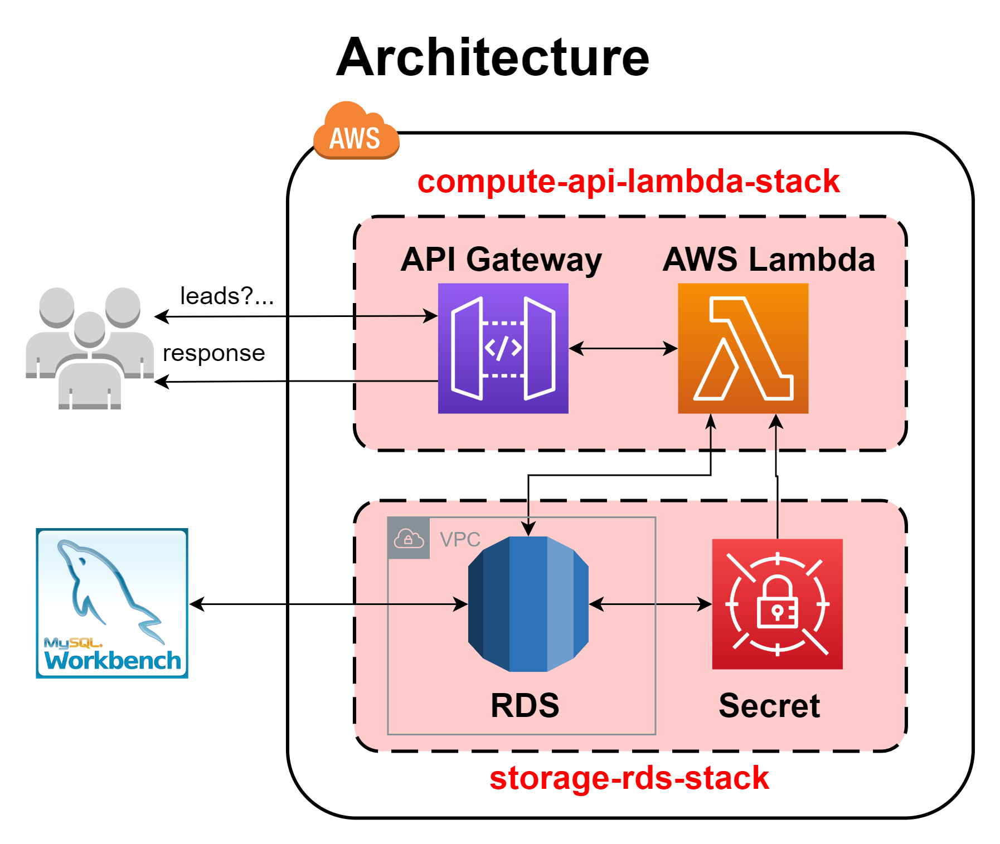
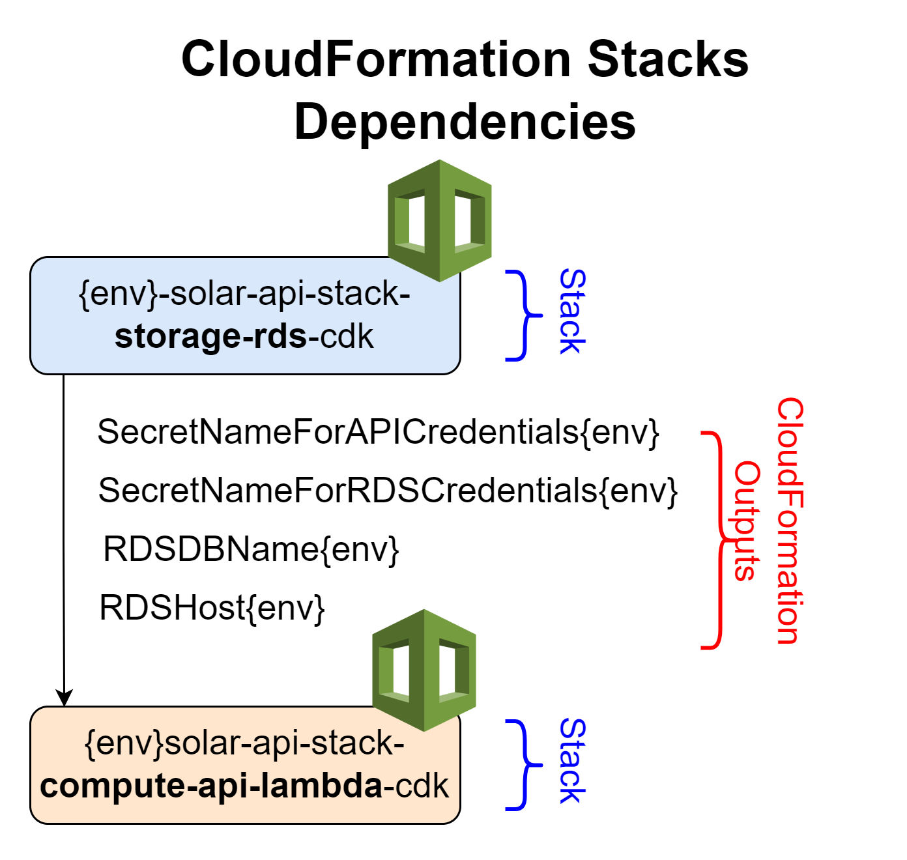

# SOLAR-COMMUNITIES-API (FREELANCE PROJECT 2020)

Infrastructure as Code and Source Development for the solar-API that queries and process lead information.

## Architecture

AWS architecture and Cloudformation Stacks segmentation for the deployment.

 <br>

## Stack Deployment Dependencies

This diagram illustrates how the CloudFormation stacks and Outputs/Inputs are related for deployments.

 <br>

## Deployment Commands

To deploy the CDK solutions, you must follow the steps on the `important_commands.sh` and deploy the needed stack. <br>

[./important_commands.sh](important_commands.sh)

Keep in mind that to control the deployment `ENVIRONMENT`, by default is `dev`, but to change to `prod`, configure the environment variable as follows:

```bash
export ENVIRONMENT="prod"
```

### CDK Deployment example

This would be an example of a development deployment for the Storage-RDS Stack:

```bash
# Go to the "cdk-solar-api" directory:
cd cdk-solar-api || echo "Make sure that the folder exists"

# Activate virtual environment for Python dependencies:
# --> Remark: if not installed, create it first and install dependencies.
source .venv/bin/activate || echo "Make sure that virtual env exists"

# Select environment for the deployment:
export ENVIRONMENT="dev"

# To see changes before deployment (changeset):
cdk synthesize --app "python3 app_storage_rds.py"

# Deploy the stack for RDS storage solution
cdk deploy --app "python3 app_storage_rds.py"
```

### CDK Deletion example (Danger Zone)

This would be an example of how to delete the Storage-RDS Stack:

```bash
# Go to the "cdk-solar-api" directory:
cd cdk-solar-api || echo "Make sure that the folder exists"

# Activate virtual environment for Python dependencies:
# --> Remark: if not installed, create it first and install dependencies.
source .venv/bin/activate || echo "Make sure that virtual env exists"

# Select environment for the deployment:
export ENVIRONMENT="dev"

# Destroy the stack if it needs to be deleted
# (WARNING): this command will delete all resources!!!
cdk destroy --app "python3 app_storage_rds.py"
```

## Extra Notes and Remarks

- If you want to delete a deployment and don't have available the CDK, you can go to the [AWS Console](https://aws.amazon.com/console/) and search for the `CloudFormation` service. Then enter the `Stacks` and search the desired stack to be delete. Then click on `Delete` option and follow the deletion steps.
- To delete one the storage stacks (in case that the solution ever requires to do so), previous stack dependencies must be delete as illustrated in the [Stack Deployment Dependencies](#stack-deployment-dependencies)
